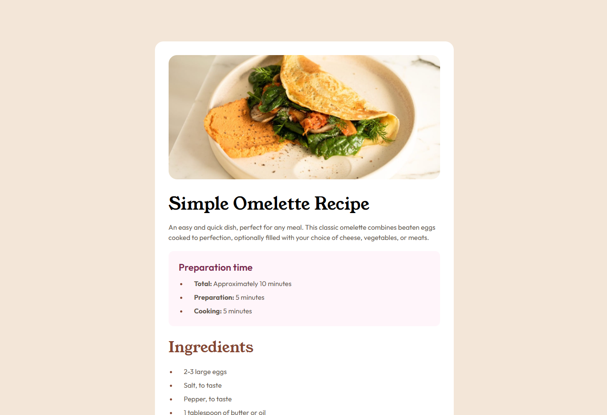

# 🌐 Frontend Mentor - Recipe page solution

This is my solution for the [Recipe page challenge on Frontend Mentor](https://www.frontendmentor.io/challenges/recipe-page-KiTsR8QQKm). Frontend Mentor challenges help you improve your coding skills by building realistic projects.

---

## 📋 Table of contents

- [Overview](#-overview)
  - [Features](#-features)
  - [Preview](#-preview)
  - [Links](#-links)
- [My process](#-my-process)
  - [Built with](#-built-with)
  - [What I learned](#-what-i-learned)
- [Development Workflow](#-development-workflow)
- [Useful Resources](#-useful-resources)
- [Author](#-author)
- [Acknowledgments](#-acknowledgments)

---

## 🌍 Overview

### ✨ Features

This page presents a structured omelette recipe featuring a hero image, preparation time, ingredients, clear step-by-step instructions, and nutrition details.
The layout is clean, responsive, and easy to follow across all devices

### 🖼️ Preview



### 🔗 Links

- 💡 Solution URL: [Frontend Mentor Submission](https://www.frontendmentor.io/solutions/recipe-page-with-css-and-tailwindcss-gARdXAYCJm)
- 🌐 Live Site URL: [Live Demo](https://thewizard04-recipe-page.netlify.app)

---

## 🛠️ My process

### 🧰 Built with

| Category  | Tools                           |
| --------- | ------------------------------- |
| Structure | **Semantic HTML5 markup**       |
| Styles    | **CSS** and **Tailwind CSS v4** |

### 🧠 What I learned

- Expanded my semantic HTML5 knowledge by learning new tags
- Strengthened my styling skills using CSS and Tailwind CSS
- Explored creating animations to enhance the user experience

I'm very proud of this CSS list style which covers 60% of the page:

```css
ul,
ol {
  list-style-position: outside;
  display: flex;
  flex-direction: column;
  gap: 8px;
  color: var(--stone-600);
}
```

```css
li {
  margin-left: 20px;
  padding-left: 16px;
  font-size: var(--font-paragraph);
  font-weight: 400;
  line-height: 1.5;
}
```

---

## 🧩 Development Workflow

### 🧱 Local Setup

1. **Start using Tailwind in your HTML**
   ```html
   <link rel="stylesheet" href="styles/tailwindcss/output.css" />
   ```
2. **Start using CSS in your HTML**
   ```html
   <link rel="stylesheet" href="styles/css/index.css" />
   ```

Then open your index.html file in the browser.

---

## 📖 Useful Resources

- [HTML Semantic Elements](https://www.w3schools.com/html/html5_semantic_elements.asp) - A helpful article explaining semantic HTML5 elements and their purpose.
- [CSS Animations](https://www.w3schools.com/css/css3_animations.asp) - A clear introduction to CSS animations and keyframes.
- [CSS Lists](https://www.w3schools.com/css/css_list.asp) - A useful guide on styling ordered and unordered lists, including list markers, positioning, and customization options.
- [HTML Tables](https://www.w3schools.com/html/html_tables.asp) - An introductory resource explaining how to create and structure tables in HTML, covering rows, cells, headers, and basic formatting.

---

## 👨‍💻 Author

- GitHub - [CrazyWizard04](https://github.com/CrazyWizard04)
- Frontend Mentor - [@CrazyWizard04](https://www.frontendmentor.io/profile/crazywizard04)

---

## 💖 Acknowledgments

A big thanks to **Frontend Mentor** for providing this project.
Their challenges are a great way for developers of all levels to practice, learn, and improve their skills through real-world examples.

Thank you <3
